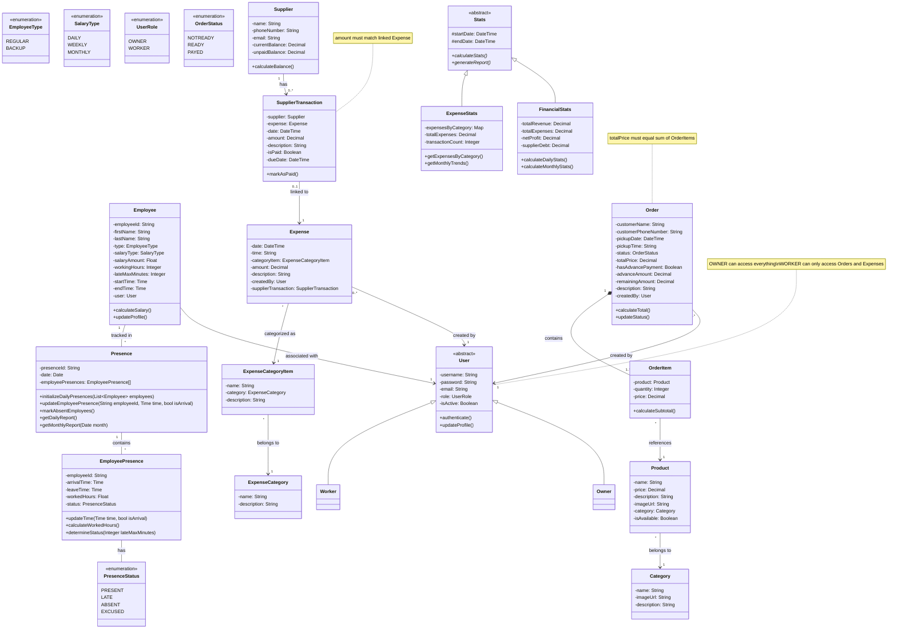

```mermaid
classDiagram
direction TB
    class User {
        -username: String
        -password: String
        -email: String
        -role: UserRole
        -isActive: Boolean
        +authenticate()
        +updateProfile()
    }

    class Employee {
        -employeeId: String
        -firstName: String
        -lastName: String
        -type: EmployeeType
        -salaryType: SalaryType
        -salaryAmount: Float
        -workingHours: Integer
        -lateMaxMinutes: Integer
        -startTime: Time
        -endTime: Time
        -user: User
        +calculateSalary()
        +updateProfile()
    }

    class EmployeeType {
        <<enumeration>>
        REGULAR
        BACKUP
    }

    class SalaryType {
        <<enumeration>>
        DAILY
        WEEKLY
        MONTHLY
    }

    class Presence {
        -presenceId: String
        -date: Date
        -employeePresences: EmployeePresence[]
        +initializeDailyPresences(List~Employee~ employees)
        +updateEmployeePresence(String employeeId, Time time, bool isArrival)
        +markAbsentEmployees()
        +getDailyReport()
        +getMonthlyReport(Date month)
    }

    class EmployeePresence {
        -employeeId: String
        -arrivalTime: Time
        -leaveTime: Time
        -workedHours: Float
        -status: PresenceStatus
        +updateTime(Time time, bool isArrival)
        +calculateWorkedHours()
        +determineStatus(Integer lateMaxMinutes)
    }

    class PresenceStatus {
        <<enumeration>>
        PRESENT
        LATE
        ABSENT
        EXCUSED
    }

    class UserRole {
        OWNER
        WORKER
    }

    class OrderStatus {
        NOTREADY
        READY
        PAYED
    }

    class Order {
        -customerName: String
        -customerPhoneNumber: String
        -pickupDate: DateTime
        -pickupTime: String
        -status: OrderStatus
        -totalPrice: Decimal
        -hasAdvancePayment: Boolean
        -advanceAmount: Decimal
        -remainingAmount: Decimal
        -description: String
        -createdBy: User
        +calculateTotal()
        +updateStatus()
    }

    class OrderItem {
        -product: Product
        -quantity: Integer
        -price: Decimal
        +calculateSubtotal()
    }

    class Product {
        -name: String
        -price: Decimal
        -description: String
        -imageUrl: String
        -category: Category
        -isAvailable: Boolean
    }

    class Category {
        -name: String
        -imageUrl: String
        -description: String
    }

    class Expense {
        -date: DateTime
        -time: String
        -categoryItem: ExpenseCategoryItem
        -amount: Decimal
        -description: String
        -createdBy: User
        -supplierTransaction: SupplierTransaction
    }

    class ExpenseCategory {
        -name: String
        -description: String
    }

    class ExpenseCategoryItem {
        -name: String
        -category: ExpenseCategory
        -description: String
    }

    class Supplier {
        -name: String
        -phoneNumber: String
        -email: String
        -currentBalance: Decimal
        -unpaidBalance: Decimal
        +calculateBalance()
    }

    class SupplierTransaction {
        -supplier: Supplier
        -expense: Expense
        -date: DateTime
        -amount: Decimal
        -description: String
        -isPaid: Boolean
        -dueDate: DateTime
        +markAsPaid()
    }

    class Stats {
        #startDate: DateTime
        #endDate: DateTime
        +calculateStats()*
        +generateReport()*
    }

    class FinancialStats {
        -totalRevenue: Decimal
        -totalExpenses: Decimal
        -netProfit: Decimal
        -supplierDebt: Decimal
        +calculateDailyStats()
        +calculateMonthlyStats()
    }

    class ExpenseStats {
        -expensesByCategory: Map
        -totalExpenses: Decimal
        -transactionCount: Integer
        +getExpensesByCategory()
        +getMonthlyTrends()
    }

    class Owner {
    }

    class Worker {
    }

    <<abstract>> User
    <<enumeration>> UserRole
    <<enumeration>> OrderStatus
    <<abstract>> Stats
    <<enumeration>> EmployeeType
    <<enumeration>> SalaryType
    <<enumeration>> PresenceStatus

    note for User "OWNER can access everything\nWORKER can only access Orders and Expenses"
    note for Order "totalPrice must equal sum of OrderItems"
    note for SupplierTransaction "amount must match linked Expense"

    User <|-- Owner
    User <|-- Worker
    Stats <|-- FinancialStats
    Stats <|-- ExpenseStats
    Order "0..*" --> "1" User : created by
    Order "1" *-- "1..*" OrderItem : contains
    OrderItem "*" --> "1" Product : references
    Product "*" --> "1" Category : belongs to
    Expense "0..*" --> "1" User : created by
    Expense "*" --> "1" ExpenseCategoryItem : categorized as
    ExpenseCategoryItem "*" --> "1" ExpenseCategory : belongs to
    Supplier "1" --> "0..*" SupplierTransaction : has
    SupplierTransaction "0..1" --> "1" Expense : linked to

    %% New relationships for Employee and Presence
    Employee "1" --> "1" User : associated with
    Employee "1" -- "*" Presence : tracked in
    Presence "1" -- "*" EmployeePresence : contains
    EmployeePresence -- PresenceStatus : has
```
